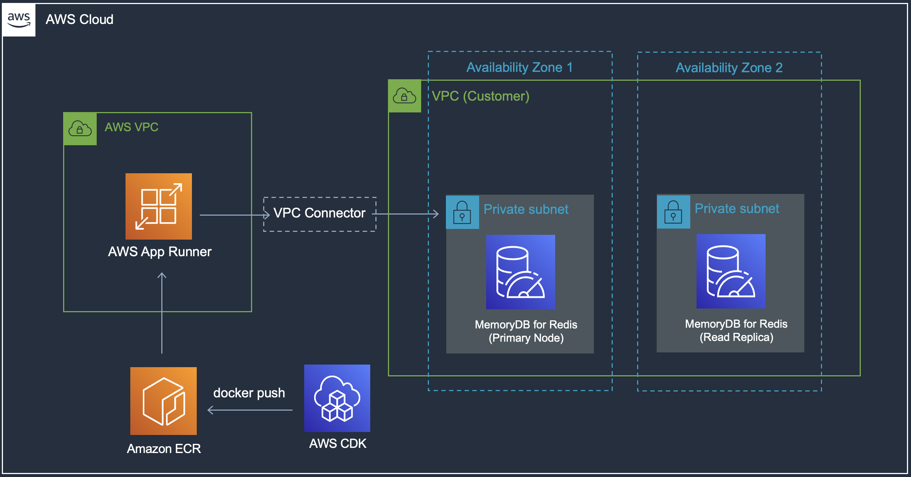

# Go and Redis application on AWS App Runner

*Use AWS CDK to package and deploy the app (along with infrastructure), and run it as an AWS App Runner service that integrates with MemoryDB for Redis*

Read more in this blog post - https://abhishek1987.medium.com/build-cloud-native-go-apps-with-aws-app-runner-redis-and-aws-cdk-e1bd7ba6ddf3

